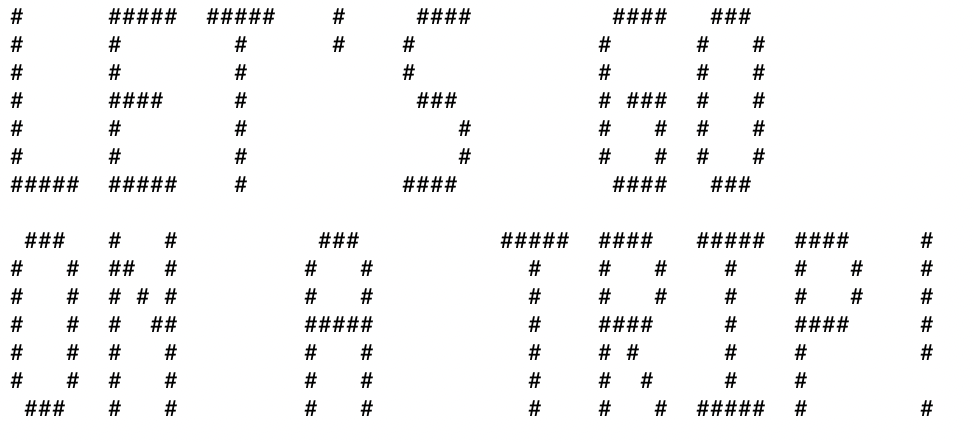
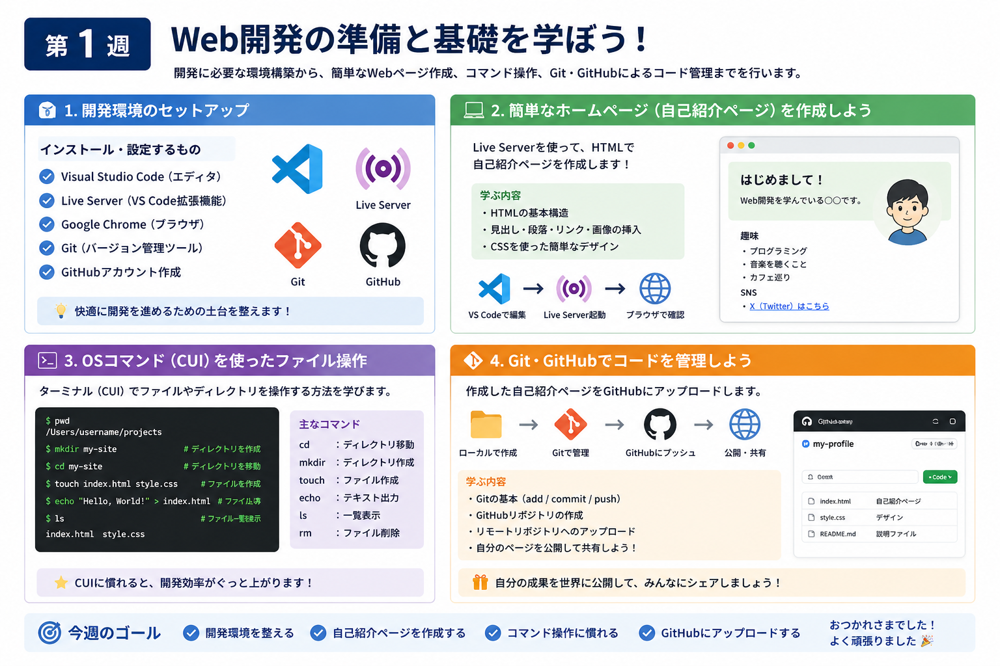
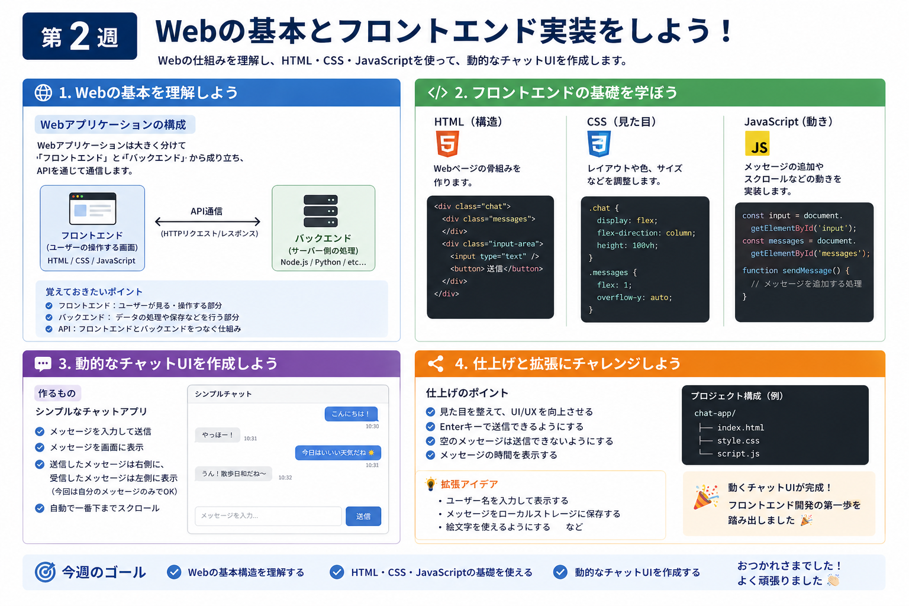
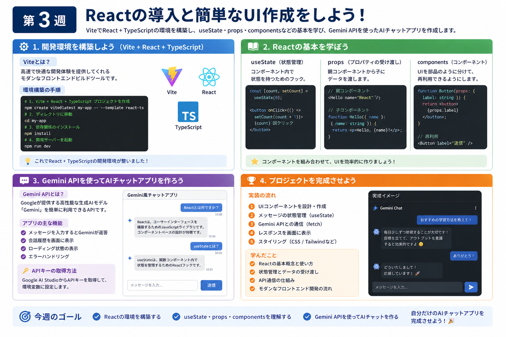
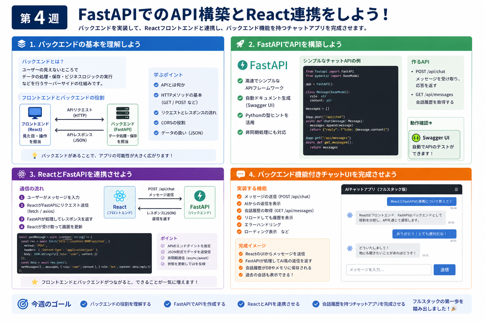
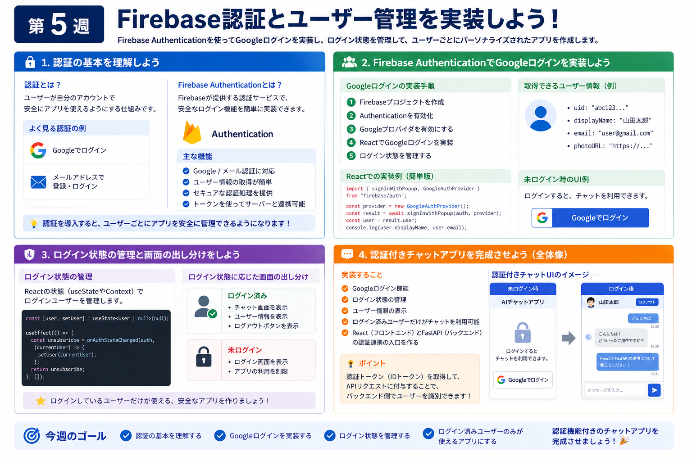
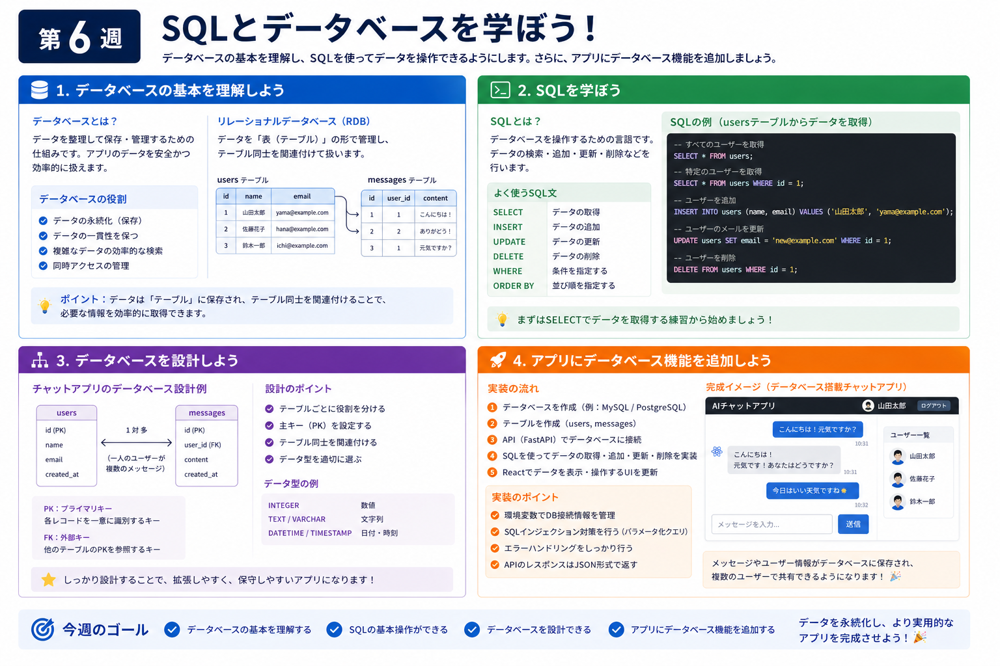
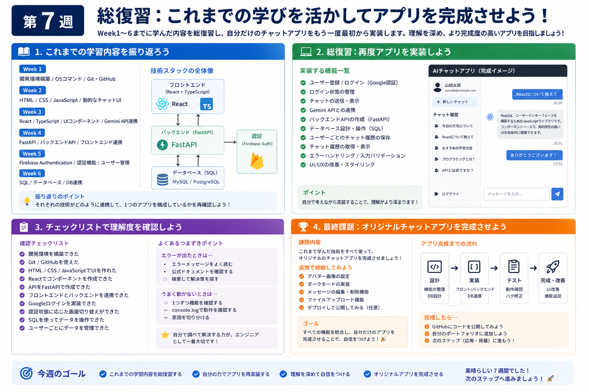

# Web開発カリキュラム

## はじめに

Web開発の世界へようこそ！
このカリキュラムでは、Web開発の基礎をお勉強できます。
生成AIの時代になり、「基本的なお作法を理解していれば」簡単なWebアプリケーションをサクッと作れるようになっています。しかしながらその「基本的なお作法」を知らなければ生成AIに聞くことすらできなかったりします。今回はChatGPTのようなUIのアプリを作ることを目標に、（AI部分は別のカリキュラムに任せて）基本的なWeb開発の手法をお勉強します。

なお、作成者はMacしか使っていない関係で、WindowsとMacでやり方が異なる場合は、UTMと呼ばれる仮想化マシン（VM）を使ってMac上でWindowsOSを動かすことで、Windowsでのやり方を説明しています。若干UTMの見た目が歪なところもありますが、基本的にWindowsでの動作を再現しているので気にしないでください。

[VM（仮想化マシン）について気になる人へ](https://www.notion.so/VM-27c0cc9f5af380f59c22cd8e1624f042?pvs=21)

---

# **Week 1 ：セットアップとOSコマンド**

まず第１週では、基本的なセットアップを行います。Web開発を進めていく上でインストールしなくてはならないものや、設定しないといけないものを進めていきます。

またLive Serverと呼ばれる拡張機能を用いて、HTMLを用いた簡単なホームページ作成をします。自己紹介ページをお互いで作ってみて、お互いの仲を深めましょう。

それが終われば、いよいよ基礎的な開発のために覚えておくべき内容を扱います。OSコマンドと呼ばれる`cd`, `mkdir`, `touch`, `echo`などのコマンドを使ったファイル操作をCUIでやる方法と、Git・GitHubを使ったコード管理を学びます。作成した自己紹介ページをGitHubにアップロードします。

[Week1](Week1/Week1.md)

# Week 2： **Webの基本とフロントエンド実装**

Week2ではWeb開発において覚えておくべき基本的な概念（フロントエンド、バックエンド、APIの関係）を学んだうえで、HTML、 CSS、 JavaScriptでフロントエンド開発を行い、「動的なチャットUI」を作成します。メッセージ入力と表示ができるシンプルなUIを作成します。

[**Week ２: Webの基本とフロントエンド実装**](Week2/Week2.md)

# **Week 3: Reactの導入と簡単なUI作成**

Week3ではReactを使ってさらにフロントエンドをきれいにしていきます。Viteと呼ばれるライブラリを利用してReactとTypeScriptと呼ばれる近年のWeb開発の基本ツールの環境を構築し、`useState`, `props`, `components` といった基本的な関数を学びます。

Week3ではGeminiのAPIを用いて、完全版ではないですが、実際に動くGeminiのようなアプリを作ってみます。

[Week3  **Reactの導入と簡単なUI作成**](https://www.notion.so/Week3-React-UI-1be0cc9f5af380b289a6c9c230d55681?pvs=21)

# **Week 4: FastAPIでのAPI構築とReact連携**

Week4では先週習ったフロントエンドに加えて、バックエンドの開発を進めます。バックエンドの概念を理解したうえで、バックエンドを簡単に実装し、さらにフロントエンドと連携させることでバックエンド機能を搭載したチャットUIを作成します。

[Week4  **FastAPIでのAPI構築とReact連携**](https://www.notion.so/Week4-FastAPI-API-React-1bf0cc9f5af38032a0abc84d8f13eae1?pvs=21)

# **Week 5:** Firebase認証とデータベース連携

Week5では認証を扱います。よくアプリを使うときにGoogleのアカウントを選択するアレですね。その機能を追加し、ユーザごとに管理されたアプリを作成します。

Week5ではWeek4までに実装したフロントエンドバックエンド機能に加え、認証機能のあるアプリを作成します。

[Week5 Firebase認証とデータベース連携](https://www.notion.so/Week5-Firebase-1e10cc9f5af380fe8e18e65b3cce8f1a?pvs=21)

# **Week 6: SQLとデータベース**

Week6ではデータベースについて学びます。データベースの概念と、SQLと呼ばれるデータベースの操作に利用する言語を学び、データベース機能を追加したアプリにアップグレードします。

[Week6 SQLの導入と環境変数の隠し方](https://www.notion.so/Week6-SQL-1ed0cc9f5af380a6a416f7b55e70bf6a?pvs=21)

# **Week 7 : 総復習**

Week7ではローカル開発の総復習を行います。Week6までに習ったことを振り返って、再度実装を行います。

[week7 総復習（フロントエンド+バックエンド+データベース接続）](https://www.notion.so/week7-1f70cc9f5af3802fbbdcf8388455af98?pvs=21)

# **Week 8: デプロイと完成発表**

Week8では実際にアプリを外部に公開する方法を学びます。Week7で作成したアプリを実際に公開し、誰でも使えるようになります。

[week8 ファイナル_デプロイをしよう](https://www.notion.so/week8-_-2120cc9f5af3804d97dff81e835d6522?pvs=21)

---

# （補講）：Dockerの利用

[Dockerの利用](https://www.notion.so/Docker-2d30cc9f5af380dd9773e8874ca7ab6a?pvs=21)

### 

[Week1 ②_backup](https://www.notion.so/Week1-_backup-1bb0cc9f5af380b1a216f4eefa94e347?pvs=21)

[テスト実装](https://www.notion.so/1880cc9f5af380b8b008d272d7324073?pvs=21)

[単語帳](https://www.notion.so/3400cc9f5af3803e9bcefef251994a06?pvs=21)