# Week1: セットアップとOSコマンド

<aside>
📋

### **このページの目次**

**1. 開発環境の準備**
- VS Code のインストールと概要、拡張機能・フォルダ操作
- HTML で自己紹介ページ（Live Server で表示）
- Node.js と npm のセットアップ
- GCP アカウント作成と無料枠の注意点
- vibe coding に触れる
- Windows 向けの補足（該当する場合）

**2. ターミナルと OS コマンド**
- OS・シェル・パスのイメージ
- `pwd` / `ls` / `mkdir` / `cd` / `rm` / `touch` / `echo` / `cat` / `mv` などの練習

**3. Git と GitHub**
- Git・GitHub の役割、リポジトリやコミットなどの用語
- インストールから `git init` → `add` → `commit` → `push` / `pull` / `clone` まで
- 最後に自己紹介ファイルを GitHub に上げる手順

💡 各章は上から順に進める想定です。必要なところだけ飛ばし読みしても大丈夫です。

</aside>

# １VSコードのインストール

（おそらくできている人も多いと思うが、改めて、、、）

## VSコード（Visual Studio Code）とは

**Microsoftが開発した無料の**コードエディタです。プログラミングに便利な機能が多くあり、開発する時のプラットフォームとしてデファクトスタンダードになっています。

特徴としては

- 無料で使える
- 多くのプログラミング言語に対応
- 拡張機能が多数

というのがあります。

まあよくわかんないと思いますが、とにかくVSコードでコードを書けば何でも作れるってことで

## インストール方法

- Macの場合
以下のサイトからダウンロードしましょう
    
    [Visual Studio Code ダウンロードページ](https://code.visualstudio.com/Download)
    この時Macのチップを選ぶように指示があると思います。この確認方法ですが、画面左上のリンゴマークをクリックして、「このMacについて」をクリックするとチップの内容について表示されます。
    それに対応するチップを選んでください。
    
- Windowsの場合
以下のサイトからダウンロードしましょう
    
    [Visual Studio Code ダウンロードページ](https://code.visualstudio.com/Download)
    
    **この時、Windows版のインストーラを選択というのが出てくると思います。**
    
    基本的には **User Installer (64-bit)** を選べばOKです。
    
    ダウンロードした `.exe` ファイルを実行してください。そうするとインストーラが起動するので、使用許諾に同意 → インストール先を選択（デフォルトのままで問題なし）しましょう。
    
    そのあと、「インストールオプション」というところで「PATHに追加する」や「右クリックメニューに追加する」などのオプションがあると思いますが、初心者はチェックを入れておきましょう。
    
    そのあとで「Visual Studio Code を起動する」にチェックを入れて完了するとすぐに起動できます。
    

# ２VSコードを触ってみよう

まずはファイルを開いてみましょう。

[VSコードの使い方.mov](https://drive.google.com/file/d/19l6IE1UmWTAxX2YJHdTBfHWxp8N_cW9T/view?usp=drive_link)

VSコードを使って、パソコンの中のフォルダにファイルを作って自由に書き込んだり保存したりすることができるかと思います。

ファイル作成後は動画のようにして保存する or ⌘+Sで保存することを忘れないようにしてください

## 拡張機能をインストールしよう

拡張機能とは：VSコードを使いやすくするために一緒にインストールしとくと後々嬉しい気持ちになる機能です。便利機能的なものだと思ってください。

いろんな人が色んな拡張機能を作ってくれていますが（こういうところから世界中のエンジニアのつながりを感じますが）、今回はよく利用される

- Live Server：書いたHTML（後述）を速攻で画面上に表示してくれる
- Prettier - Code formatter：コードの整形をしてくれる
- Japanese Language Pack for Visual Studio Code：日本語にしてくれる（←うれしい）

を利用します。

拡張機能は左のサイドバー上の四角がたくさんある謎マークをクリックして検索&インストールできます

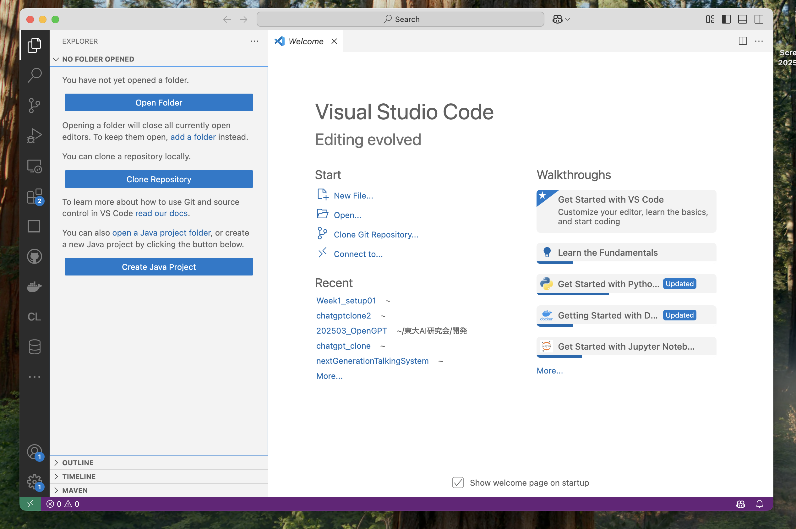

## フォルダを作ろう

ソースコードはすべてフォルダごとに管理されます。

プログラミングと聞くと１つの膨大なコードが書かれたファイルを使うのかと思われがちですが、実際はたくさんの小さなファイルを作ってフォルダとしてアップロードしたりします。


VSコードでは非常にシンプルにフォルダを作ることができます。

以下の動画を参照してください。

- Macの人
    
    [Macの VS Codeファイル作成.mov](https://drive.google.com/file/d/1_MuX7kzgrlhwihLVV70MM_iGLSkPJ0kU/view?usp=drive_link)
    
- Windowsの人
    
    [Windowsの VS Codeファイル作成.mov](https://drive.google.com/file/d/1HhQVmPXa1OEmcoptzoIjM6Vq8Khe2L0x/view?usp=drive_link)
    

# 3 HTMLで自己紹介ページを作ってみよう

## HTMLとは？

HTMLは **「Webページを作るための言語」** です。

正式には **"HyperText Markup Language"（ハイパーテキスト・マークアップ・ランゲージ）** と言いますが、簡単に言うと **「Webサイトの骨組み」** を作るものです。

他にもcssやJavaScriptがWebページの作成には必須の知識となりますが、まずはHTMLを書いてみましょう


論より証拠、まずは以下のコードをコピペしてVSコードに貼り付けてみよう。（〇〇のところは自分に合わせてね）

このとき、拡張子を.htmlにすることをお忘れなく。こうすることでパソコンが「このファイルはHTMLを使ってるんだ！」と認識できます

```html
<!DOCTYPE html>
<html lang="ja">
<head>
    <meta charset="UTF-8">
    <meta name="viewport" content="width=device-width, initial-scale=1.0">
    <title>自己紹介</title>
</head>
<body>
    <h1>こんにちは！</h1>
    <p>私は〇〇です。趣味は△△です。</p>
</body>
</html>
```

先ほど作ったフォルダに、動画を参考にして貼り付けてみてください。

またhtmlファイルは慣例的にindex.htmlとすることが多いです。理由は知りません

[index.htmlを編集してWebページを見る.mov](https://drive.google.com/file/d/1QjycLEsR2vvTemu_HSsx7tEWhrPQ_fOQ/view?usp=drive_link)

vsコードで新しいファイルindex.htmlを作り、貼り付け

その後vsコード左下の「Go LIVE」のボタンを押すと、ブラウザ上にhtmlが表示されます。

[[http://127.0.0.1:5500/index.html](http://127.0.0.1:5500/index.html)って何？](https://www.notion.so/http-127-0-0-1-5500-index-html-1b90cc9f5af380a5b922ce8e970743f8?pvs=21)

ブラウザ上にめでたく出力されました。これで今日のノルマ①終了です

# ３Node.jsとnpmのセットアップ

続いてNode.jsとnpmのセットアップを行います。

Node.jsってなんやねんってなると思いますが（僕もなっていますが）、アプリ開発で必須なものだとおもってください。興味ある人は下記の記事をどうぞ

https://qiita.com/non_cal/items/a8fee0b7ad96e67713eb

他にもwebアプリを作る方法は多数ありますが、一番オーソドックス（？）なものがnode.jsを用いたものなので、とりあえずインストールしちゃいましょう

- Macの場合
    - 以下のサイトにアクセスして、Mac用のNode.jsをダウンロードします。
        
        [Node.js公式サイト](https://nodejs.org/)
        
    - 「LTS（推奨版）」を選択し、ダウンロードした `.pkg` ファイルを開いてインストールを進めます。
    - **インストール確認**
        
        ターミナルを開き、以下のコマンドを入力してインストールが完了しているか確認します。
        
        ```bash
        node -v
        
        ```
        
        ```bash
        npm -v
        ```
        
        どちらもバージョンが表示されればOKです！
        
    
    うまくいかない場合は
    
    ```bash
    brew install node
    ```
    
    というふうにターミナルで打ってみたあとで、node -v とnpm -vを実行してください。
    
- Windowsの場合
    
    [Windowsでのnodeのsetup.mov](https://drive.google.com/file/d/1a3WUWbfXw5pb87ktp41kavJvQVlwNoI5/view?usp=drive_link)
    
    [https://nodejs.org/en/download](https://nodejs.org/en/download)
    上記の公式サイトにアクセスし、動画のように操作してダウンロードを進めてください。
    

以下のコマンドを叩いて、インストールできてるか確認してね

```jsx
node --version
```

（もしインストールが完了してもnode --versionでnode command is not foundなどと出てくるときは一度VSコードを閉じてもう一回開いてみて）

ではnodeのコマンドでちょっとだけチュートリアルしてみましょう。

動画のようにして、画面上に文字が出てくるか確認してください

1. `hello.js` というファイルを作成し、以下の内容を記述します。
    
    ```
    console.log("Hello, Node.js!");
    ```
    
2. ターミナルでこのファイルがあるディレクトリに移動し、以下のコマンドを実行。
    
    ```
    node hello.js
    ```
    
3. 確認！

[nodeのインストール.mov](https://drive.google.com/file/d/1_t0kYcszkIre8H6fFn7FUUFVfD7oJbb4/view?usp=drive_link)
<!-- [https://drive.google.com/file/d/1Qkqn_T-wzX6qJivVcWlcCz5W1c9x4B1f/view?usp=drive_link](https://drive.google.com/file/d/1Qkqn_T-wzX6qJivVcWlcCz5W1c9x4B1f/view?usp=drive_link) -->

これがうまくいっていれば、node.jsの設定はバッチリです！

.jsで表記されたものは、JavaScriptと呼ばれる言語で管理されています。これは先ほどの解説にもある通り、動的な（動きのある）ページを作ることに特化した言語です。

普通JavaScriptは、SafariやChromeといったブラウザ上でしか使えない言語で、先ほどの動画のように、ブラウザを介さないで動かすことができない言語です。しかしNode.jsを導入したことで、パソコン内のファイルでもJavaScriptを動かすことができたわけです。

だからなんやねんと言われれば（現状では）困っちゃいますが、ともかくいつでもどこでもJavaScriptが使えるようになったことが美味しいと思ってください。

## npmについて

npmについても解説しておきます。

npmとはNode.jsのパッケージ管理ツールのことです。AppStoreみたいなものだと思ってください。

スマホアプリをAppStore（ないしGoogle Play Store）でインストールするのと同じ要領で、

npm install （インストールしたいもの）の順番でコマンドを叩きます。

**npm install axios**　だったらaxiosというライブラリをインストールする、という意味です。

手元でやってみましょう。

[npm installをする.mov](https://drive.google.com/file/d/1URYeVUQWyrQD3BduTyqzQL5aVTY-Ejno/view?usp=drive_link)


# ４GCPアカウントの作成と無料枠の準備

最後は **GCP（Google Cloud Platform）** のアカウントを作成し、無料枠を設定していきます。ちょっと退屈かもしれませんが、これをやっておけば、後々の開発がスムーズになります！💪✨

## GCPとは？

GCPとはGoogleが提供するクラウドサービスでサーバー、データベース、機械学習などが使える超便利な環境です。

簡単にいうと、通常web開発を行うためには、サーバーを用意する必要があるのですが、それをGoogleさんが提供してくれているので勝手に使わせてもらえるよって話です。

競合にAWSがあります。この世界は概ねこのGCPとAWS、それとMicrosoft Azureの３大クラウドサービスに支えられて動いています。

これらの使い方を[マスターするためだけの検定](https://cloud.google.com/learn/certification?hl=ja)が存在するほど、これらのツールを使い倒すことがWebエンジニアの要となります。

ではスタートしましょう。Mac Windows関係なく以下の手順で始められます。

- **GCP公式サイトにアクセス**
- **Googleアカウントでログイン**
- **「無料で開始」ボタンをクリック**
- **支払い情報を入力**
→ クレジットカードが必要ですが、**無料枠の間は課金されません！**

# **このとき学校のアカウントは絶対に使わないでください。絶対に使わないでください。絶対に使わないでください！！！！**

学校のアカウントだと一部の利用が制限されていたりします。ちょっとややこしいので。


「無料で開始」をクリック

アカウント情報やクレカの入力画面になると思うので、そのまま埋めて利用開始を押してください。

クレカ情報とかが見えちゃうので動画にできませんごめんなさい

いずれにしても画像のようなコンソール画面に入れていれば成功です


もしかしたらプロジェクトの作成などを最初に求められるかもです。テキトーに名前つけちゃってください。

いずれにしてもこの画面まで来れていれば大丈夫です！お疲れ様でした！

チェックボックス

- [ ]  VSコードがインストールできた
- [ ]  自己紹介ページを確認できた
- [ ]  学校のアカウントではない自分のアカウントでgcpのアカウントを作成できた

# 5 vibe codingをしてみよう！

さてここまでセットアップしてみた上で、vibe codingを試してみましょう。

vibe codingというのはアンドレイ・カルパシーさんという弊団体のコンテンツの一つであるnano GPTの元ネタを提供してくださった、元OpenAIの東大AI研究会にとってのGODが提唱した概念で、生成AIを使い倒して「バイブスに乗るかのように」プログラミングをしまくることです。

実はここまでセットアップしたものを使って、ChatGPTの指示通りに作ってみると案外ものができたりします。今回は先ほど作ったHTMLのWebページをChatGPTに編集をお願いして綺麗にしてみましょう。以下のプロンプト（編集自由）を打ち込んで、ChatGPTにHTMLを書いてもらいます。

```
以下のコードを参照して、名探偵コナン風のwebページになるようにHTMLを編集してほしい。cssは不要で、HTMLだけで記述せよ

<!DOCTYPE html>
<html lang="ja">
<head>
    <meta charset="UTF-8">
    <meta name="viewport" content="width=device-width, initial-scale=1.0">
    <title>自己紹介</title>
</head>
<body>
    <h1>こんにちは！</h1>
    <p>私は〇〇です。趣味は△△です。</p>
</body>
</html>
```

この結果を先程と同様にindex.htmlに書き込み、Go Liveで出来上がりを見てみましょう。


近藤がやるとこんな感じになりました。いや〜生成AIがあればコーディングもお茶の子さいさいですね〜

これでセットアップセクションは終了です。では次にOSコマンドについて学んでいきましょう。

<aside>
💡

# ！！！Windowsの皆様へ！！！

これ以降、Linuxとよばれるコマンドをたくさん使用します。Macでは標準装備されているコマンドがLinuxとほぼ同じなので問題ないですが、WindowsのデフォルトになっているPowerShellでは互換性が少なく、しばしばエラーが起きます。

そのため以下のページを参照して、PowerShellをgit bashと呼ばれるものに変更しておいてください。

[git bashの設定方法](https://www.notion.so/git-bash-3440cc9f5af38073a04df367044bc0ed?pvs=21)

</aside>

# 6 OSコマンドの基礎

## OSとは？

OS（オペレーティングシステム）とは、**コンピュータを動かすための基本的なソフトウェア**のことです。

Windows、macOS、Linux、iOS、Android などが代表例です。

OSは主に次の役割を持ちます：

- **アプリを動かす**（ブラウザやゲームなど）
- **ハードウェアを管理する**（キーボード・マウス・ディスプレイなどをドライバ経由で制御）
- **データを管理する**（ファイルの保存・削除など）

OSは、コンピュータ全体を管理する**司令塔のような存在**です。

例えば、

- キーボードを打つと文字が表示される
- スマホをタップすると画面が切り替わる

といった「当たり前の動作」は、すべてOSが裏で制御しています。

普段は自動で動いてくれますが、人間がOSに直接指示を出したいときに使うのが**OSコマンド（コマンドライン操作）**です。


## 例

`OSが勝手にやってくれるver`

メモ帳アプリを開いて新規作成を押す→文字を入力して「保存」を押す

（こうすると裏側でこっそりOSがファイルの作成と保存の処理をしてくれる）

`OSコマンドで人間が指示するver`

以下のShellを実行する

```bash
touch newfile.txt  # (Linux/macOS)
```

```bash
echo. > newfile.txt  # (Windows)
```

上の二つの行為は同じことになります。

これから死ぬほどファイルを作ったり消したり移動したり死ぬほどやるので、そのためのコマンドをまず覚えましょう！

# 7 OSコマンドの練習

VSコード上で左上の「ターミナル」を選択してください。


この部分ですね

Windowsの人は左上の３本線から「ターミナル」→「新しいターミナル」を選びましょう。


またターミナルを開くショートカットキーもあります。

MacだとCtrl+Shift+^、WindowsだとCtrl+Shift+`を押すとターミナルが開きます。便利なので覚えておきましょう。

- Macの人へ
    
    Macの人はターミナルというアプリケーションがそもそも存在しているので、それを利用しても良いです。
    
    アプリ一覧→その他→ターミナルを選んで、「ターミナル」というアプリを開いてください
    
    
    
    Terminalを探せ
    
    これ以降ターミナルでの操作も可能です。ただしVSコードでのターミナルのほうが見やすいので推奨しています。
    

次に、VSコードで先ほど作成したディレクトリを開いてください。


右から３番目の「ターミナル」をクリックすると左下にターミナルが開きます。

**以降はVSコード上で操作します**

以下のコマンドを覚えたら終了です。（まだまだありますが、一旦こんなもんにしましょう）

```bash
pwd
ls
mkdir
cd (ディレクトリ名)
cd ..
rm
touch
echo "文字列" > "file名"
cat
mv
```

では一つずつ見ていきましょう

<!-- [Screen Recording 2025-04-30 at 13.41.16.mov](Week1/Screen_Recording_2025-04-30_at_13.41.16.mov) -->

## pwd

`pwd`コマンドは「現在のディレクトリを表すコマンド」です。

print working directoryの略（だと思います）

`pwd` と入力しただけで、「今自分のいるディレクトリ」を出力します。


こんな感じに出てきます。現在はWeek_1_setup01というディレクトリにいるらしいです。

## ls

`ls`コマンドは「現在のディレクトリの配下にあるもののリスト」です。

`ls` と入力しただけで、配下にあるものがすべて見れます。


lsを押してエンターすると

hello.js        hogehoge.txt    index.html

と出てきます。

## mkdir

`mkdir`コマンドは「現在のディレクトリの下に新規でディレクトリを作るコマンド」です。

`mkdir (新規ディレクトリ名)` と入力することで新しいディレクトリが作成されます。

[mkdirテスト.mov](https://drive.google.com/file/d/1Qz3FDz-0YW51xOs9-FNAvICKyl5Ce_A5/view?usp=drive_link)

mkdir newdirectoryと入力するだけで、新しいディレクトリが左上に作成されていることが確認できます

## cd (ディレクトリ名)

`cd`コマンドは「現在のディレクトリの下の特定のディレクトリに移動するコマンド」です。

`cd (ディレクトリ名)` と入力することでディレクトリを移動できます

[cdテスト.mov](https://drive.google.com/file/d/1KJ9QZKr_qjnH7ZNkGnCQuF8vzvNPa35_/view?usp=drive_link)

cd newdirectoryと打つことで、先ほど作成したディレクトリに移動できていることが確認できます

またcd （存在しないディレクトリ）と打つと、No such file or directoryというエラーが出ます。新しくディレクトリを作ってそっちに移りたい時はmkdirしてcdしてください

## cd ..

先ほどのcd は特定のディレクトリに移動するコマンドでしたが、cd ..（ピリオド２個）と入力すると、現在のディレクトリの親ディレクトリに移動できます


cd ..とすることで、newdirectoryディレクトリからweek1_setupディレクトリに移動できることが確認できます

## rm

`rm`コマンドは「現在のディレクトリの下の特定のファイルを削除する（removeする）コマンド」です。

`rm (ファイル名)` と入力することで特定のファイルを削除できます

[rmテスト.mov](https://drive.google.com/file/d/1M92z1D_i_gqB0eYnWrInrZt-MhG9TnJ1/view?usp=drive_link)

rm hogehoge.txtとしたことでhogehoge.txtが消えていることを確認してください。

`rm -r (ディレクトリ名)` とするとディレクトリごと削除できます

## touch

`touch`コマンドは「現在のディレクトリの下の特定のファイルを作成するコマンド」です。

`touch (ファイル名)` と入力することで特定のファイルを作成できます

[touchテスト.mov](https://drive.google.com/file/d/1bLLQ3cgnP7eWsCC7x8zkcrl0l4TvnL3Y/view?usp=drive_link)

touch hogehoge.txtとしたことで、hogehoge.txtファイルが作成されたことを確認してください

## echo "文字列" > file名

`echo`コマンドは「現在のディレクトリの下の特定のファイルに書き込むコマンド」です。

echo 文字列 > file名　でファイルに「文字列」を書き込むことができます。

[echoテスト.mov](https://drive.google.com/file/d/178B-U_f-PAANw7WLLIM6j3cIEtWyK0i1/view?usp=drive_link)

コマンドを叩くだけで、勝手にhogehoge.txtに書き込みが行われていることが確認できます。

## cat

`cat`コマンドは「現在のディレクトリの下の特定のファイルの内容をみるコマンド」です。

`cat file名`  でファイルの様子がわかります。


確かに書き込めていることがわかります。

## mv

`mv`コマンドは「現在のディレクトリの下の特定のファイルを特定の場所に移動するコマンド」です。

`mv file名 移動先`   で実行できます

[mvテスト.mov](https://drive.google.com/file/d/15iKYTgQvKnMH8IV5E_sqxcKmrZRjeVmT/view?usp=drive_link)

hogehoge.txtがnewdirectoryに移動できたことがわかります。

（全部やっている動画を挿入する）

では最後に全てのコマンドを使って復習してみましょう。動画の内容で何をやっているのか確認しながら見てください。

[コマンド全復習.mov](https://drive.google.com/file/d/1YqoBwr7kA3tWVmtmcIcd0Ge9-831GN5G/view?usp=drive_link)

最後に以下の一問一答に答えましょう。（クリックで解答が開きます）

**Q1.** 今いるディレクトリを確認するコマンドは？

<details>
<summary>解答を表示</summary>

`pwd`

</details>

**Q2.** ディレクトリの中身を一覧表示するコマンドは？

<details>
<summary>解答を表示</summary>

`ls`

</details>

**Q3.** 新しくディレクトリを作成するコマンドは？

<details>
<summary>解答を表示</summary>

`mkdir (ディレクトリ名)`

</details>

**Q4.** ディレクトリを移動するコマンドは？

<details>
<summary>解答を表示</summary>

`cd (ディレクトリ名)`

</details>

**Q5.** 一つ上の階層に戻るコマンドは？

<details>
<summary>解答を表示</summary>

`cd ..`

</details>

**Q6.** ファイルを削除するコマンドは？

<details>
<summary>解答を表示</summary>

`rm (ファイル名)`

</details>

**Q7.** 新しくファイルを作るコマンドは？

<details>
<summary>解答を表示</summary>

`touch (ファイル名)`

</details>

**Q8.** ファイルの中身を見るコマンドは？

<details>
<summary>解答を表示</summary>

`cat (ファイル名)`

</details>

**Q9.** ファイルを移動するコマンドは？

<details>
<summary>解答を表示</summary>

`mv (ファイル名) (移動先)`

</details>

**Q10.** ファイルに文字を書き込むコマンドは？

<details>
<summary>解答を表示</summary>

`echo "文字列" > file名`

</details>

# 8 Gitの基本操作

さて次に、開発するうえで必ず通るGit・GitHubについて学んでいこうと思います。

まずGitとGitHubの概念についてまとめます。

### Gitとは？

Gitとは、**ファイルの変更履歴を管理できるバージョン管理システム**です。プログラムのソースコードやドキュメントの変更を記録し、過去の状態に戻したり、チームでの共同開発をスムーズに進めたりできます。

Google Documentで編集の履歴とかが確認できますよね？あんな感じのやつです。

### GitHubとは？

Gitのデータをオンラインで保存・共有するサービスです。手元で自分のファイルのバージョン管理をするものがGitで、それぞれのパソコンで保存されているGitをWeb上で共有するものがGitHubです。

例えばAI研のカリキュラムはこのGitHubで公開されています。

[https://github.com/HayatoHongo/ColabGPT](https://github.com/HayatoHongo/ColabGPT)

何がええんや？と思いますが、Git/GitHubがないとこんなことになります

- 変更履歴がわからない→「昨日うまく動いてたのに、コードを修正したらバグが出た。どこを変えたんだっけ、、、」

2 チーム開発が地獄 

<aside>
⚠️

開発メンバーが同じファイルを編集すると…

😡 **Aさん:** 「俺の修正が全部消えたんだけど！？」

😨 **Bさん:** 「ごめん、最新版上書きしちゃった…」

</aside>

Gitがあれば！他人の変更を取り込めたりするのでチーム開発のカオスが解消します！！

3 複数人でのコード共有が難しい

<aside>
⚠️

「最新のコードをメールで送るね！」

📧 **メールでコードをやり取りする時代に逆戻り** 😱

ファイルの **バージョン管理がめちゃくちゃ** になり、エラーの原因に…。

</aside>

Gitがあれば！Github（後述）を用いることで最新のコードを共有できる

### GitHubの概念、用語

紙芝居でお伝えします

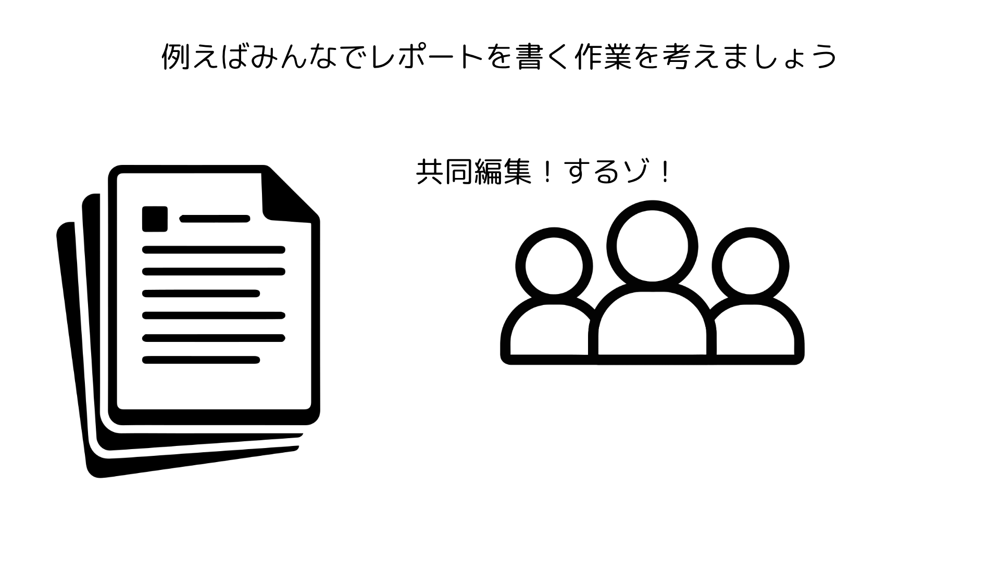

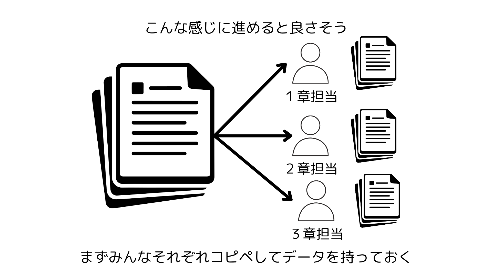

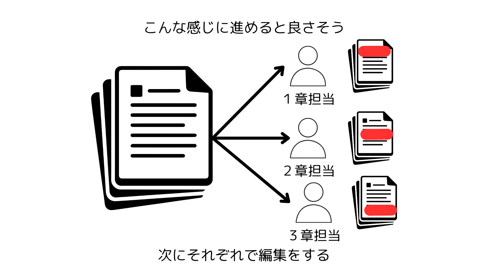

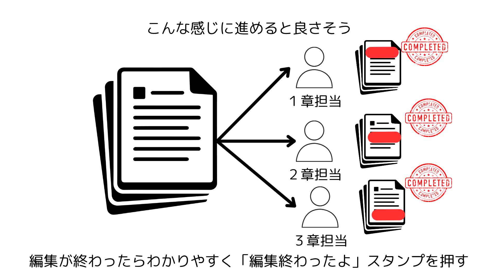

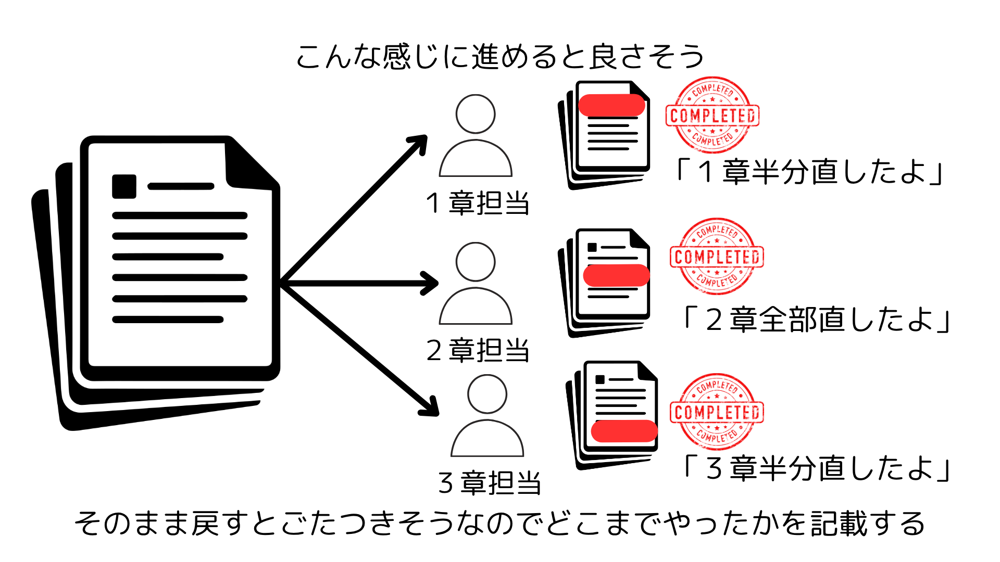

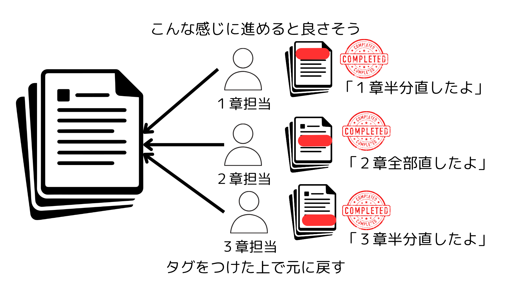

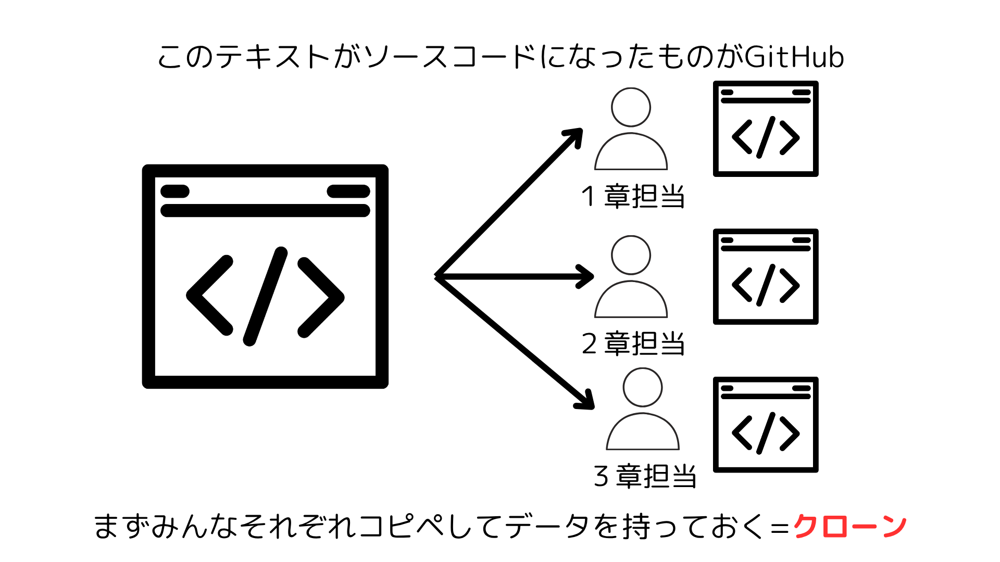

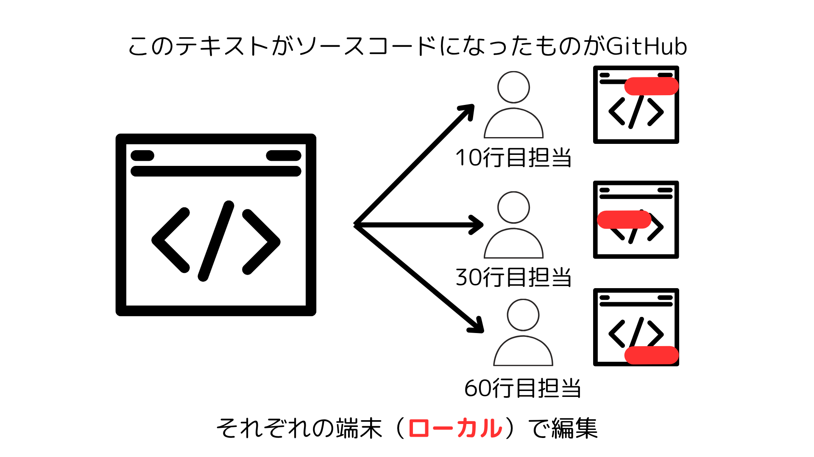

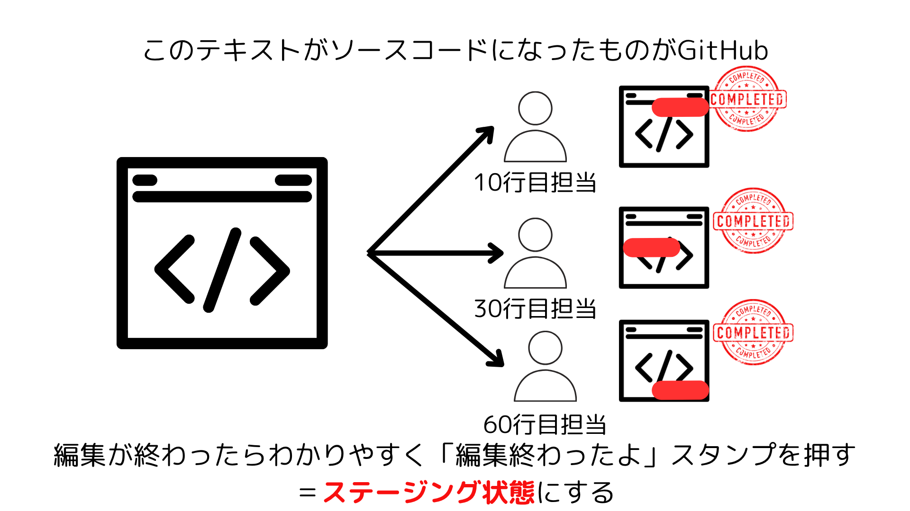

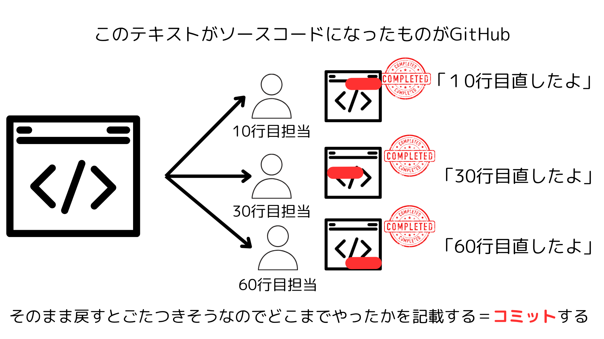

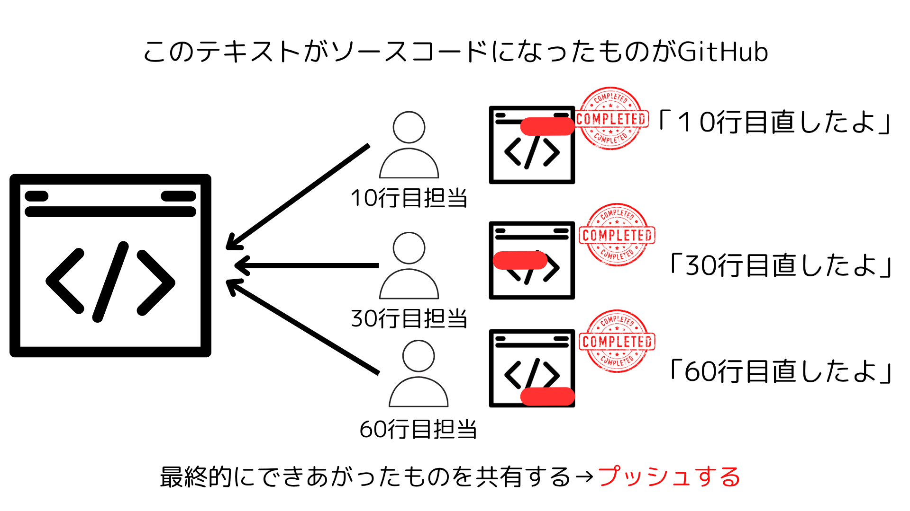

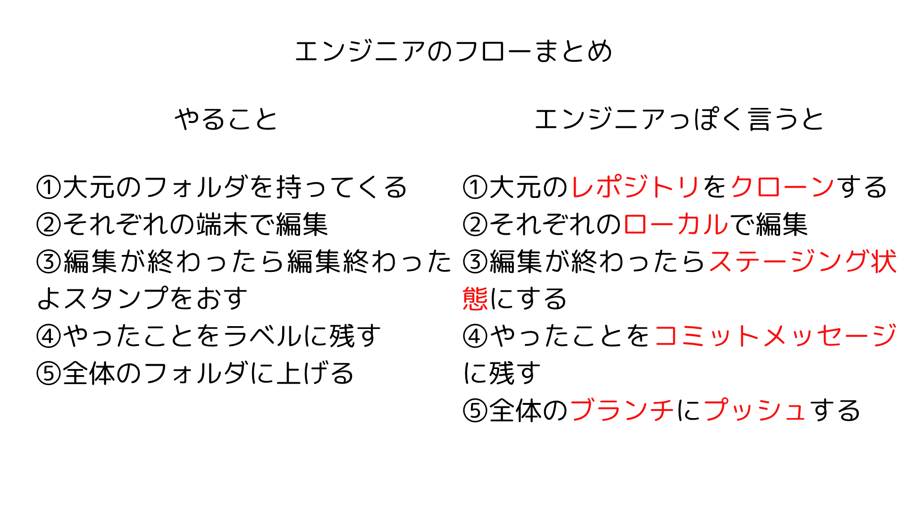

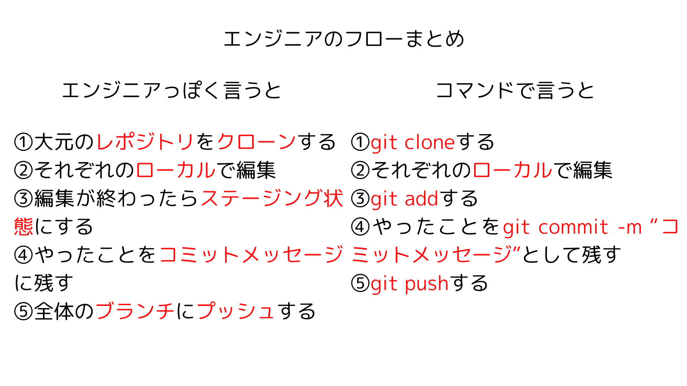
ここで用語を整理しておきましょう。

- リポジトリ
Gitで管理されているプロジェクトのこと。Gitで保存しているフォルダのようなものだと思えば良い
- ローカル、リモート
ローカルは手元のパソコン上、リモートはクラウド上の場所を指します。
上の用語と合わせると「ローカルリポジトリ」「リモートリポジトリ」という言葉が誕生します。
それぞれ自分の手元のパソコンに存在しているフォルダ、GitHubでクラウド上に存在しているフォルダ、という意味です
- コミット
ファイルの変更を保存すること。⌘+Sを押すイメージです。
- ステージング
コミットを行う前に、ファイルを「コミット準備状態」にすること
- ブランチ
コードの別の作業スペースgit 
ブランチを切ることで今までの作業から分岐した作業スペースを作ることができ、そこで作業できる
- マージ
ブランチを統合すること。それぞれのワークスペース（ブランチ）で作業した後、全体で統合する操作のこと
- プル
リモートリポジトリ（ネット上にあるGitのリポジトリ=GitHub）から最新の変更を取得すること
- プッシュ
ローカルの変更をリモートリポジトリ（ネット上にあるGitのリポジトリ=GitHub）に送信すること


# 9 Git/GitHubを使ってみよう

## インストール

- Macの場合
    
    以下のコマンドをターミナルで実行してください。
    
    ```bash
    git --version
    ```
    
    これで　git version 2.30.1 などと表示されれば問題ありません。
    
    コマンドラインデベロッパーツールをインストールしますか？というポップアップが出てくれば、インストールボタンを連打してください。
    
    続いて以下の２つのコマンドでGitの初期設定を行いましょう
    
    ```bash
    git config --global user.name "ユーザー名"
    git config --global user.email "メールアドレス"
    ```
    
    メールアドレスなどは自由に決めてもらって大丈夫です。
    
    以下のコマンドでうまく設定できているか確認してください
    
    ```bash
    git config user.name
    git config user.email
    ```
    
- Windowsの場合
    
    実はもうインストールできているはずです
    
    [git bashの設定方法](https://www.notion.so/git-bash-27b0cc9f5af3805781d1f836be14804a?pvs=21) 
    
    こちらでgit bashを有効化するタイミングでインストールできています。
    
    ```bash
    git --version
    ```
    
    で何かしら表示されることを確認してください。
    
    続いて以下の２つのコマンドでGitの初期設定を行いましょう
    
    ```bash
    git config --global user.name "ユーザー名"
    git config --global user.email "メールアドレス"
    ```
    
    メールアドレスなどは自由に決めてもらって大丈夫です。
    
    以下のコマンドでうまく設定できているか確認してください
    
    ```bash
    git config user.name
    git config user.email
    ```
    

続いてGitHubの設定を行います。以下のURLにアクセスしてください

[GitHub · Build and ship software on a single, collaborative platform](https://github.com/)

サインアップなどの必要な操作をしてください。

ログインに成功すると下記のような画面になると思います。


## GitHubに自分の変更を上げてみよう

### 1. リポジトリの作成

GitHubのダッシュボード右上の➕ボタンを押して、「New repository」をクリックする


すると下記のようになるので、好きな名前でリポジトリ名(repository name)を設定し、publicかprivateか（全体のユーザーに公開するかどうか）を選択する。


そして下の方にある「create repository」をクリックする

そうすると画面が遷移して画像のようになる


このGitHub上のレポジトリに、自分の手元で変更してアップロードするところまでを動画でお見せします。Week2という新しいフォルダを使ってVSコードを開いています。

以下のコードを実行するだけではあります

```jsx
git clone https://github.com/kondotaichi/new.git （自分のレポジトリ名に設定してください）
cd new
echo "# new" >> README.md     # 新規作成 or 追記
git add README.md             # 明示的にステージする
git commit -m "first commit"  # これでコミットできるはず
git push -u origin main       # リモートに反映
```

[gitコマンド.mov](https://drive.google.com/file/d/1TqHsfDgryJ5jDxP8u1UXlE2K9E_gWuJA/view?usp=drive_link)

上記のコマンドが頭の中に入っていればだいたい耐えます。

説明が雑魚いと思うので主要なコマンドをしっかり説明します。

以下の１０個くらいコマンド覚えれば十分です。近藤も５つくらいしかわかりません。

### ① `git init`：「このフォルダでGitを使い始める」という宣言

✅ 意味

- 現在のフォルダを **Gitで管理できるようにする**。
- `.git`という隠しフォルダが作られ、**履歴の記録**ができる状態になる。

🛠️ 使い方

```bash
mkdir my-project
cd my-project
git init
```

この操作で「Gitリポジトリ」が作られます。

📦 結果

- `my-project/.git/` というディレクトリがひっそりできる。

`ls -a` コマンドで隠しファイルも含めたディレクトリを確認できます。

.gitのように . から始まるファイルやディレクトリは「隠しファイル、隠しフォルダ」といい、フォルダ上では確認できません。lsではなくls -aのような隠しファイルも見せる指示を与えると確認できます。

- `git status` で状態が確認できるようになる。

---

### ② `git add`：ファイルの変更を「記録候補」にする

✅ 意味

- ファイルを **次のコミットに含める準備**をする。
- 「保存してね」とGitに伝える感じ。
- これはめっちゃ使うので覚えましょう。

🛠️ 使い方

```bash
echo "Hello" > hello.txt
git add hello.txt
```

🧠 補足

- `git add .` とすると、カレントディレクトリ以下の全ファイルを追加できる。
- 「addしたファイル」だけがコミット対象になる。

---

### ③ `git commit`：変更を記録として保存

✅ 意味

- **ステージされたファイル**（addしたもの）を履歴として保存。
- 「このタイミングの状態を記録！」ということ。
- これも死ぬほど使うので覚えましょう。

🛠️ 使い方

```bash
git commit -m "初めてのコミット"
```

🧠 補足

- `m`は「メッセージ」の略。履歴に残す説明文を書く。
- 後から何をしたか振り返るのに大事です！

---

### ④ `git status`：今の状態を確認する

✅ 意味

- 「今、どのファイルを変更したか」「どれがadd済みか」などを教えてくれる。
- これは必須ではない知識ですが、ログが見れるので重宝されます。覚えましょう。

🛠️ 使い方

```bash
git status
```

💬 出力例

```bash
Untracked files:
  (use "git add <file>..." to include in what will be committed)
    hello.txt
```

これは、「hello.txtという新しいファイルがあるけど、addされてないよ」という意味です。

---

### ⑤ `git log`：履歴を見る

✅ 意味

- これまでのコミットの履歴を確認できる。
- これも必須ではない知識ですが、ログが見れるので重宝されます。覚えましょう。

🛠️ 使い方

```bash
git log
```

💬 出力例

```bash
commit 38fa02abac...
Author: Taichi <taichi@example.com>
Date:   2025-04-30

    初めてのコミット
```

ここまでの動画を取ってみました

[git練習１.mov](https://drive.google.com/file/d/16SJtGUcbmllfDPyR6OPKJj92YxdATbdC/view?usp=drive_link)

---

### ⑥ `git clone`：GitHubからプロジェクトをコピー

✅ 意味

- **GitHubにあるリポジトリ**を自分のPCにコピー（クローン）してくる。
- これも死ぬほど使います

🛠️ 使い方

```bash
git clone https://github.com/ユーザー名/リポジトリ名.git
```

これでそのリポジトリの全データが`リポジトリ名/`フォルダに入ってくる。

---

### ⑦ `git push`：変更をGitHubにアップロード

✅ 意味

- 自分のPCで記録した変更（コミット）を **GitHubに送る**。
- チームや公開の場に反映させる。

🛠️ 使い方

```bash
git push -u origin main
```

- `origin`はGitHubのアドレス（リモート名）
- `main`はブランチ名

？git push -u origin mainって何

originはリモートのレポジトリ名（プッシュ先のGitHubのレポジトリ）、mainはプッシュ対象のブランチです。

-uをつけることで、これ以降の操作でoriginとmainをセットにしてね！という意味になる

本来、git pushコマンドはgit push （push先のレポジトリ）（push対象のブランチ）という記法で書く必要があるが、push -u origin mainとすると、これ以降セットでoriginとmainが対応することが明示され、これ以降pushするときは git pushと打つだけで可能になる。

これら２つに関する動画はこちら

[git練習２.mov](https://drive.google.com/file/d/12_kXOoVDo3llKm9LTHSAlPqE3goDxt5I/view?usp=drive_link)

---

### ⑧

`git branch`：ブランチを作る・確認する

`git checkout`：作ったブランチに移る

✅ 意味

- 「ブランチ＝作業の分岐路」
- 別の作業内容を本線とは分けて進められる。
- 「ブランチを分ける」ときに使います。

🛠️ 使い方

```bash
git branch newbranch
```

- newブランチの作成

```bash
git checkout newbranch
```

- newブランチへの移動

```bash
git checkout -b newbranch
```

このコマンドで新しいブランチを作ってそこに移るができる

git branch と git checkoutを一気にできます。

[git練習３.mov](https://drive.google.com/file/d/1PtMkyNbGrVo1ynR7WIEd-9gZusHEqtDt/view?usp=drive_link)

この動画でpushのコマンドがgit push -u origin newbranchとなっていることに注意してください。

pushのコマンドはgit push （レポジトリ名）（ブランチ名）になります。

---

### ⑨ `git pull`：GitHubの変更を自分のPCに取り込む

✅ 意味

- GitHubにある最新の変更を、**自分の環境に反映**する。
- チーム開発をするわけではないぼっち勢はあんまつかわんかも

🛠️ 使い方

```bash
git pull origin main
```

---

### ⑩ `git remote add origin`：GitHubと接続する

✅ 意味

- このローカルのリポジトリと、GitHub上のリポジトリを**ひもづける**。

🛠️ 使い方

```bash
git remote add origin https://github.com/ユーザー名/リポジトリ名.git
```

この後に `git push` をすれば、GitHubにアップロードできるようになる。

⑨と⑩の動画です

[git練習４.mov](https://drive.google.com/file/d/19DaAYGw9OTaaxJmf0gT-dB5h1z2yDTOD/view?usp=drive_link)

## 🔚 最後に：これさえ覚えれば大丈夫！！

```bash
git init
git add .
git commit -m "初回コミット"
git branch -M main
git remote add origin https://github.com/ユーザー名/リポジトリ名.git
git push -u origin main
```

### ※git push -u origin mainでうまくいかないあなたへ

[git pushのトラブルシューティング (1)](https://www.notion.so/git-push-1-3440cc9f5af38078b06df416ee4ff680?pvs=21)

# 4 自己紹介ファイルをGitHubに上げよう！

まずはweek2_setup内に「self-intro」フォルダを作りましょう

作ったら以下のコマンドで移動&git初期化

```jsx
cd self-intro
git init
```

続いてREADME.mdという名前のファイルをself-intro下に作って、自己紹介を書いてみる


なんでもいいので保存して、GitHubに上げてみましょう

というわけでレポジトリを作ります。自己紹介なので、publicではなくprivateにしましょうか。

